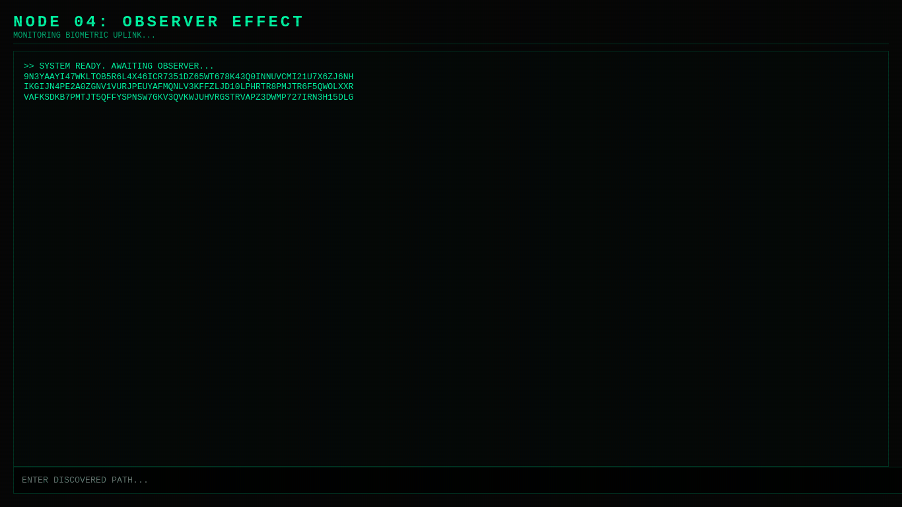

# Signal vs Noise

> Not everything is meant to be obvious.

A multi-layered interactive terminal experience where patterns hide inside chaos.

No instructions.  
No walkthrough.  
Only signals.

---

## ▶️ Start

👉 https://signalvsnoise.netlify.app

---

## 🧩 What is this?

A sequence of nodes.

Each one:
- hides information differently
- requires a shift in thinking
- reacts to how you interact with it

This is not a game you *play*.

It’s a system you **learn to observe**.

---

## ⚠️ Important

- There are no explicit clues.
- There is no UI guidance.
- If you're stuck, that's part of it.

---

## 👁️ Hint (if you really need one)

> The pattern repeats.  
> Time matters.  
> Perspective changes everything.  
> Observation alters the signal.

---

## 🧪 Built for

- Puzzle solvers  
- ARG enthusiasts  
- Curious minds  

---

## 🎬 Preview

---

## 🧬 Philosophy

At first, you try to decode the system.

Eventually, you realize:

**the system is decoding you.**

---

## 📌 Notes

This repository is a **preview layer only**.  
The actual logic is intentionally obscured.